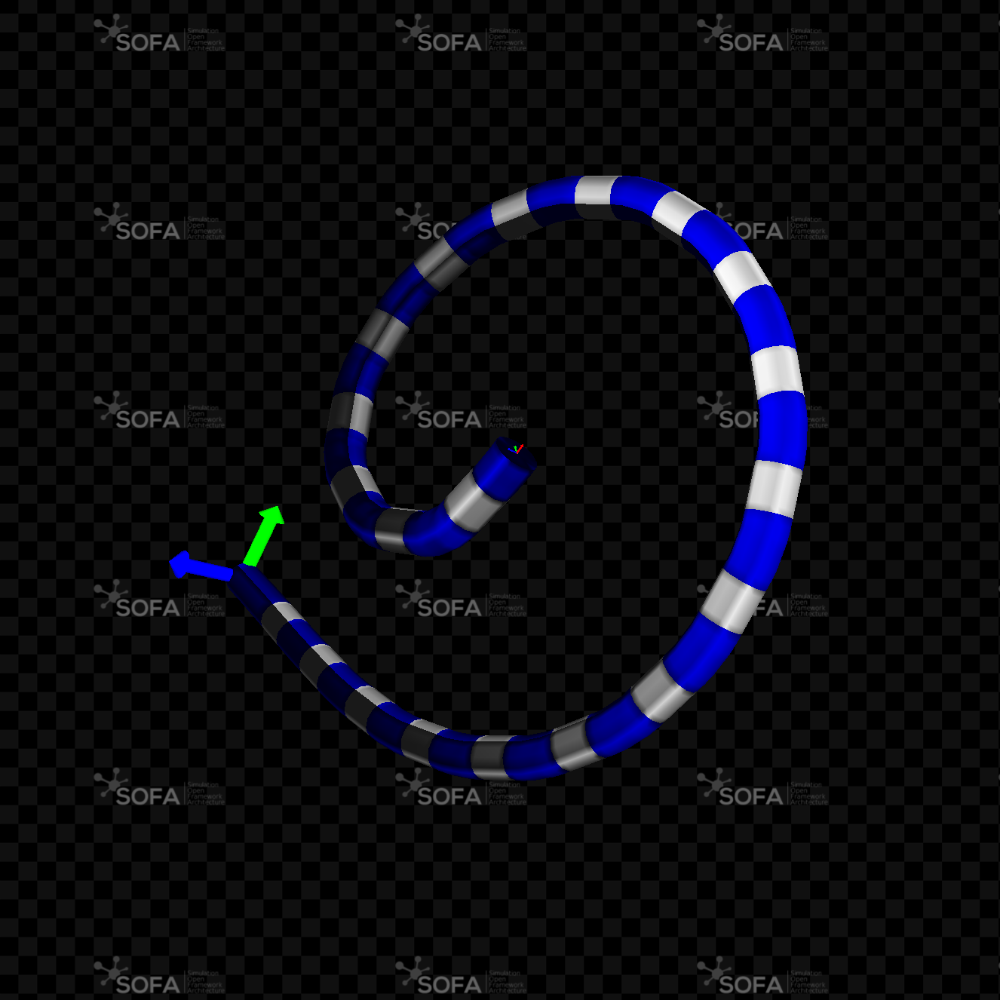
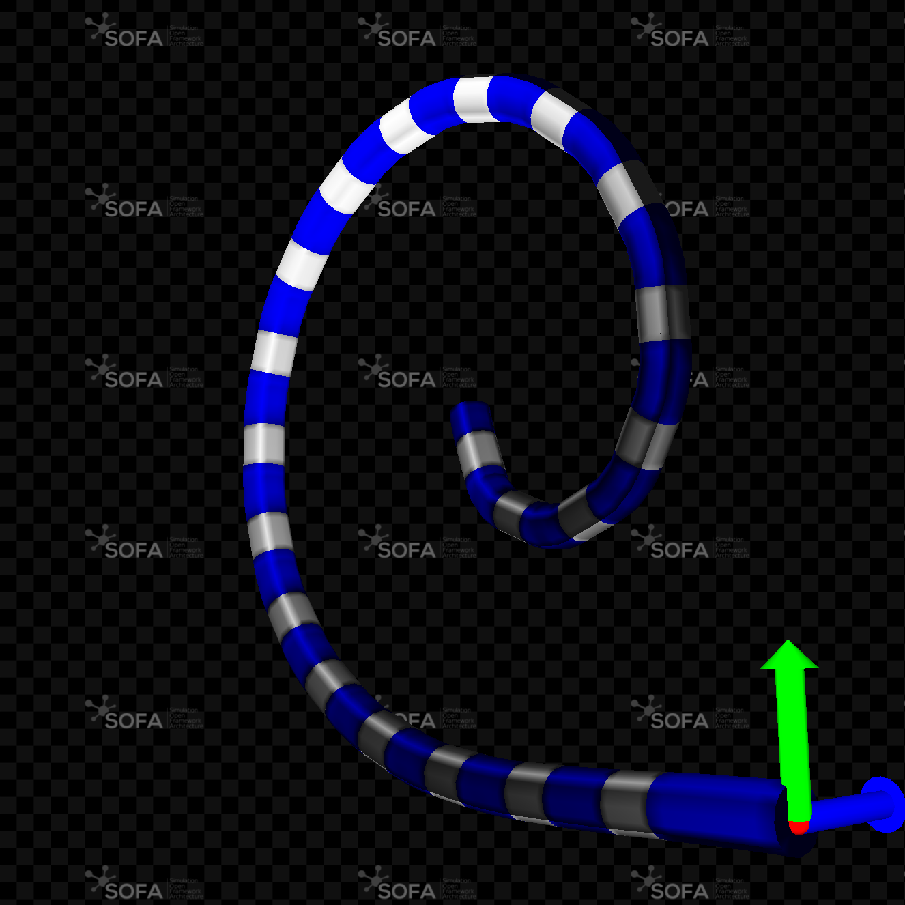
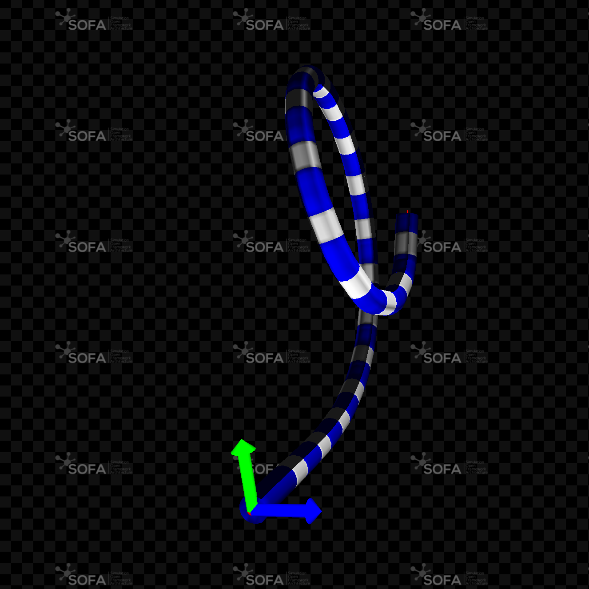
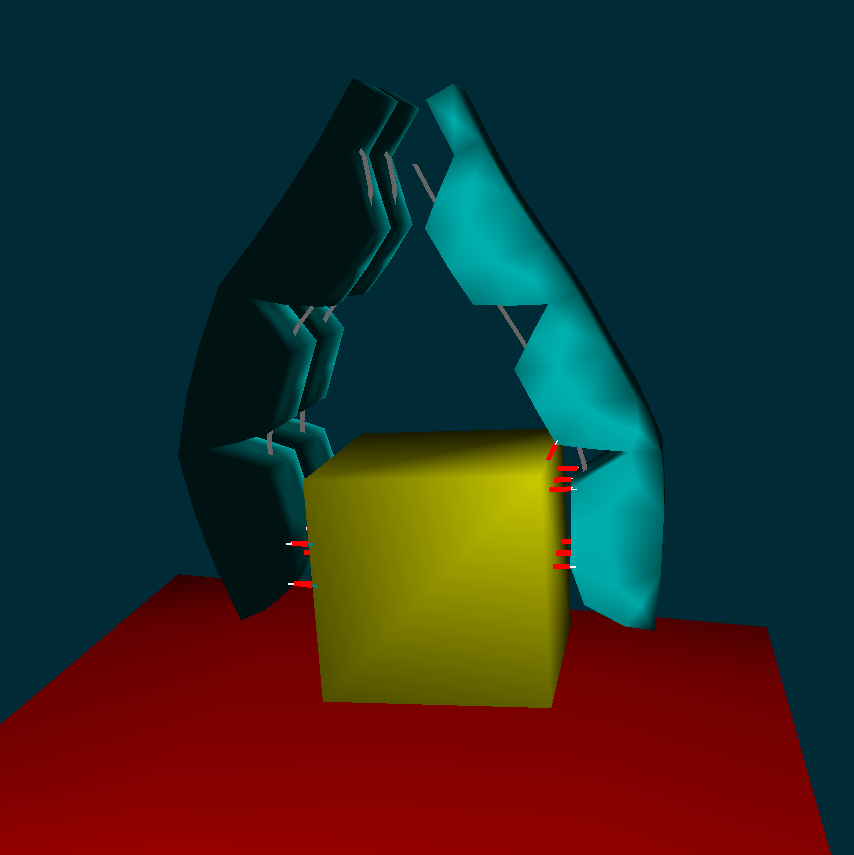
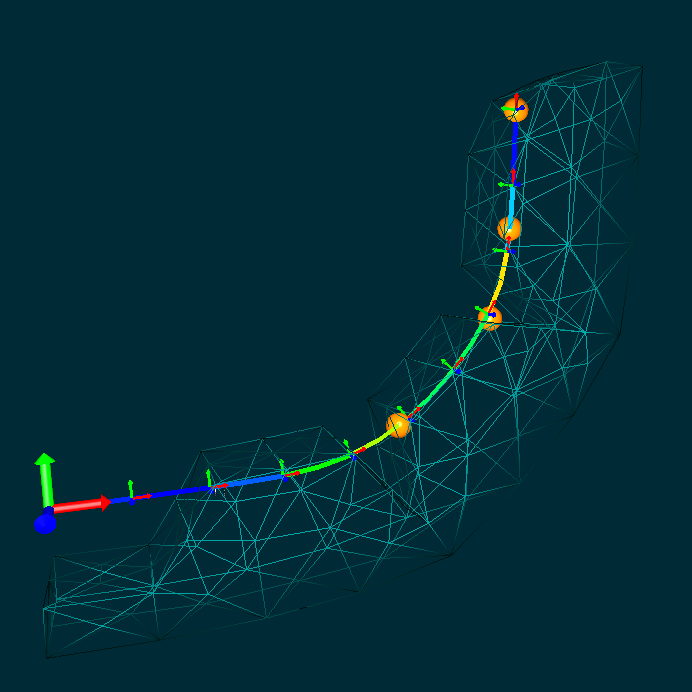
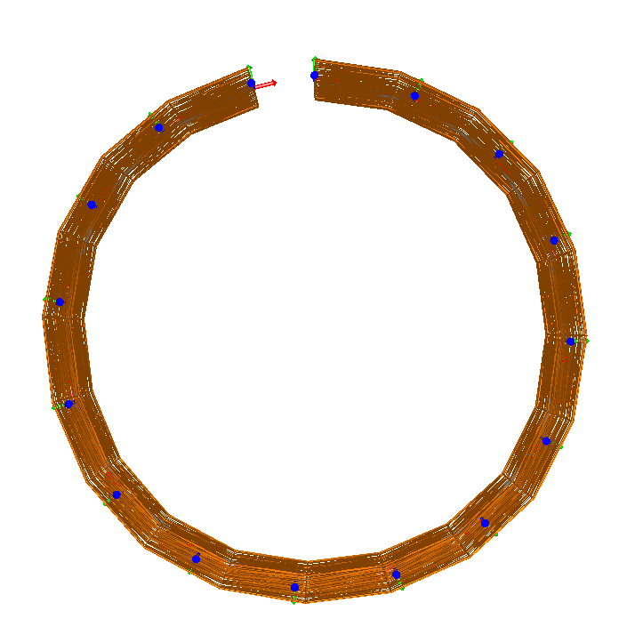

# Cosserat
<div class="highlight-content">
<strong>Overview</strong> 

An open-source plugin, designed to be compatible with the Sofa framework, facilitates the simulation of 1D objects. 
Specifically, it caters to the modeling of both rigid and flexible 1D entities, like rods, wires or needles, using the Cosserat beam theory.
In this context, we have outlined a range of potential applications for this plugin. If you wish to explore its functionality, you have the flexibility to construct scenes using Python or XML, or you can take it a step further by developing new C++ components.
We also welcome contributions from the community to enhance and expand the capabilities of this plugin.

</div>

## Description related to Soft-body modeling

The Cosserat model has found applications in the realm of continuum robotics, particularly for simulating the deformation of robot bodies with geometries and mechanical properties akin to rods. 
This model aligns closely with the dynamic deformation patterns exhibited by soft manipulators, as it can effectively replicate nonlinear deformations encompassing bending, torsion, extension, and shearing.

One distinctive feature of Cosserat's theory, within the domain of continuous media mechanics, lies in its conceptualization:
it views each material point of an object as a rigid body with six degrees of freedom (three translations and three rotations).
In contrast, many other models in continuum media mechanics tend to treat material points as particles with only three translation degrees of freedom.

When modeling linear structures, this framework enables the creation of a structure closely resembling articulated solids, consisting of a series of rigid bodies whose relative positions are defined by their strain states. 
Consequently, this model serves as a versatile tool for modeling and controlling a variety of systems, including concentric tube robots, continuum robots driven by cables, or pneumatic soft robots with constant cross-sections.

Go into theorotical part of the plugin [Theory](examples/python3/tutorial/Writerside/topics/Theory.mdexamples/python3/tutorial/Writerside/topics/Theory.md)

Follow the tutorial : [cosserat_tutorial](tutorial/text/cosserat_tutorial.md)
## Some use cases


### Modeling and control

Lorem ipsum dolor sit amet, consectetur adipiscing elit, sed do eiusmod tempor incididunt ut labore et dolore magna aliqua. 

#### Direct control

Lorem ipsum dolor sit amet, consectetur adipiscing elit, sed do eiusmod tempor incididunt ut labore et dolore magna aliqua. 

#### Modeling cochlear implant using Discret Cosserat Model (DCM)


| View 1                                                                                       | View 2                                                                                       | View 3                                                                                       |
|----------------------------------------------------------------------------------------------|----------------------------------------------------------------------------------------------|----------------------------------------------------------------------------------------------|
|  |  |  |


## Utilizing the Discrete Cosserat Model for Cable Modeling in Deformable Robot Control:


| Direct simulation of a soft gripper                                                       | The study of the model convergence                                                            |
|-------------------------------------------------------------------------------------------|-----------------------------------------------------------------------------------------------|
|  |  |


---

<strong> Actuation </strong>

|  |  |  |
|---------------------------------------------------------------------------------------------------------------|:----------------------------------------------------------------------------------------------------------------:|--------------------------------------------------------------------------------------------------------:|
| DCM Beam actuation using a cable ```d =```                                                                    |                                    DCM Beam actuation using a cable ```d =```                                    |                                                                  Beam actuation using a cable ```d =``` |


|  |  |  |
|----------------------------------------------------------------------------|:-------------------------------------------------------------------------:|----------------------------------------------------------------------------:|
| DCM Beam actuation using a cable ```d =```                                 |                DCM Beam actuation using a cable ```d =```                 |                                      Beam actuation using a cable ```d =``` |

<strong> Tripod using bending lab sensors </strong>
Format: ![Alt Text]


### Inverse Control


## Publications
1. Pieces-wise constant Strain PCS: This feature is based on the paper
- __Discrete cosserat approach for soft robot dynamics: A new piece-wise constant strain model with torsion and shears__ [Link to the paper](https://ieeexplore.ieee.org/document/7759808)
- __Coupling numerical deformable models in global and reduced coordinates for the simulation of the direct and the inverse kinematics of Soft Robots__ [Link to the paper](https://ieeexplore.ieee.org/abstract/document/9362217).
The link to download the Pdf of the Paper: __https://hal.archives-ouvertes.fr/hal-03192168/document__

<div align="center">
  <a href="https://www.youtube.com/watch?v=qwzKAgw31pU"></a>
</div>

2. Pieces-wise Non-constant Strain:
3. DCM with Plastic model


%%% old_version 
[](https://app.gitter.im/#/room/#sofa-framework_cosserat-needle-insertion:gitter.im)
[](https://github.com/sofa-framework/sofa/discussions/categories/cosserat)


# Description

Cosserat model has been introduced in continuum robotics to simulate the deformation of the robot body whose geometry
and mechanical characteristics are similar to a rod.
By extension, this model can be used to simulate needles, wires.
The specificity of Cosserat's theory from the point of view of the mechanics of continuous media, is to consider that: each material point
of an object is rigid body(3 translations, 3 rotations), where most other models of continuum media mechanics consider
the material point as particles (3 translations).
For the modeling of linear structures, it is therefore possible to find a framework very close to the articulated solids with a series
of rigid body whose relative position is defined by a strain state.
This model can be used to model and control concentric tube robots, continuum robots actuated with cables, or pneumatic soft robots
with a constant cross-section.

## Features

1. Pieces-wise constant Strain PCS: This feature is base on the paper
   1. __Discrete cosserat approach for soft robot dynamics: A new piece-wise constant strain model with torsion and shears__ [Link to the paper](https://ieeexplore.ieee.org/document/7759808)
   2. __Coupling numerical deformable models in global and reduced coordinates for the simulation of the direct and the inverse kinematics of Soft Robots__ [Link to the paper](https://hal.archives-ouvertes.fr/hal-03192168/document)

<div align="center">
  <a href="https://www.youtube.com/watch?v=qwzKAgw31pU"></a>
</div>

2. Pieces-wise Non-constant Strain:
3. DCM with Plastic model

### Modelling cochlear implant using Discret Cosserat Model (DCM)

| View 1                                                                                      | View 2                                                                                      | View 3                                                                                      |
|---------------------------------------------------------------------------------------------|---------------------------------------------------------------------------------------------|---------------------------------------------------------------------------------------------|
|  |  |  |

### DCM for cable modeling to control deformable robots:
| Direct simulation of a soft gripper                                                      | The study the model convergence |
|------------------------------------------------------------------------------------------| --- |
|  | |

### Some use cases

|      |            |   |
| ------------- |:-------------:| -----:|
| DCM Beam actuation using a cable ```d =``` | DCM Beam actuation using a cable ```d =```| Beam actuation using a cable ```d =```|


|      |     |   |
| ------------- |:-------------:| -------------:|
| DCM Beam actuation using a cable ```d =``` | DCM Beam actuation using a cable ```d =```| Beam actuation using a cable ```d =```|


Format: ![Alt Text]

