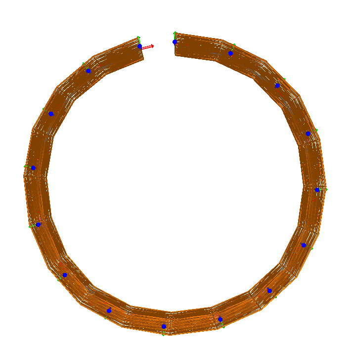

[](https://app.gitter.im/#/room/#sofa-framework_cosserat-needle-insertion:gitter.im)
[](https://github.com/sofa-framework/sofa/discussions/categories/cosserat)


# Description

Cosserat model has been introduced in continuum robotics to simulate the deformation of the robot body whose geometry
and mechanical characteristics are similar to a rod.
By extension, this model can be used to simulate needles, wires.
The specificity of Cosserat's theory from the point of view of the mechanics of continuous media, is to consider that: each material point
of an object is rigid body(3 translations, 3 rotations), where most other models of continuum media mechanics consider
the material point as particles (3 translations).
For the modeling of linear structures, it is therefore possible to find a framework very close to the articulated solids with a series
of rigid body whose relative position is defined by a strain state.
This model can be used to model and control concentric tube robots, continuum robots actuated with cables, or pneumatic soft robots
with a constant cross-section.

## Features

1. Pieces-wise constant Strain PCS: This feature is base on the paper
   1. __Discrete cosserat approach for soft robot dynamics: A new piece-wise constant strain model with torsion and shears__ [Link to the paper](https://ieeexplore.ieee.org/document/7759808)
   2. __Coupling numerical deformable models in global and reduced coordinates for the simulation of the direct and the inverse kinematics of Soft Robots__ [Link to the paper](https://hal.archives-ouvertes.fr/hal-03192168/document)

<div align="center">
  <a href="https://www.youtube.com/watch?v=qwzKAgw31pU"></a>
</div>

2. Pieces-wise Non-constant Strain:
3. DCM with Plastic model

### Modelling cochlear implant using Discret Cosserat Model (DCM)

| View 1                                                                                      | View 2                                                                                      | View 3                                                                                      |
|---------------------------------------------------------------------------------------------|---------------------------------------------------------------------------------------------|---------------------------------------------------------------------------------------------|
|  |  |  |

### DCM for cable modeling to control deformable robots:
| Direct simulation of a soft gripper                                                      | The study the model convergence |
|------------------------------------------------------------------------------------------| --- |
|  | |

### Some use cases

|      |            |   |
| ------------- |:-------------:| -----:|
| DCM Beam actuation using a cable ```d =``` | DCM Beam actuation using a cable ```d =```| Beam actuation using a cable ```d =```|


|      |     |   |
| ------------- |:-------------:| -------------:|
| DCM Beam actuation using a cable ```d =``` | DCM Beam actuation using a cable ```d =```| Beam actuation using a cable ```d =```|


Format: ![Alt Text]

