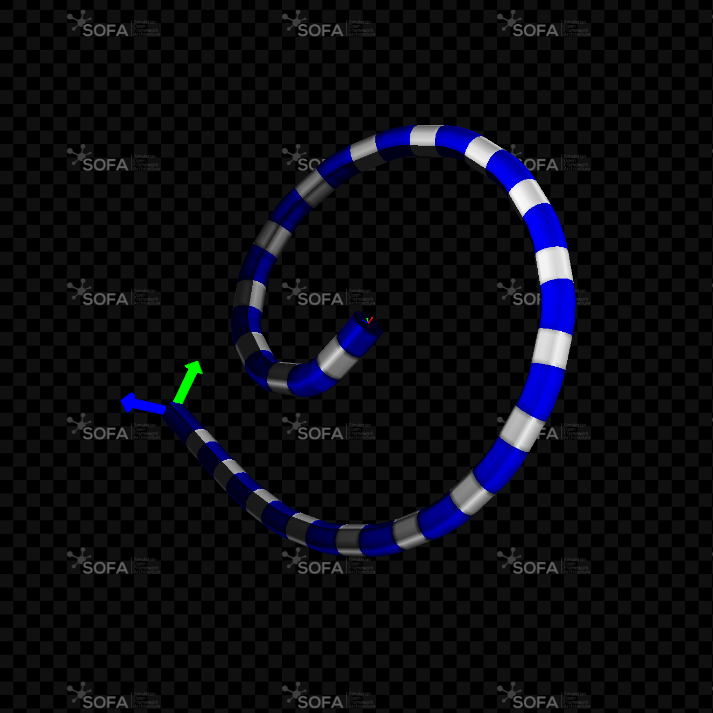
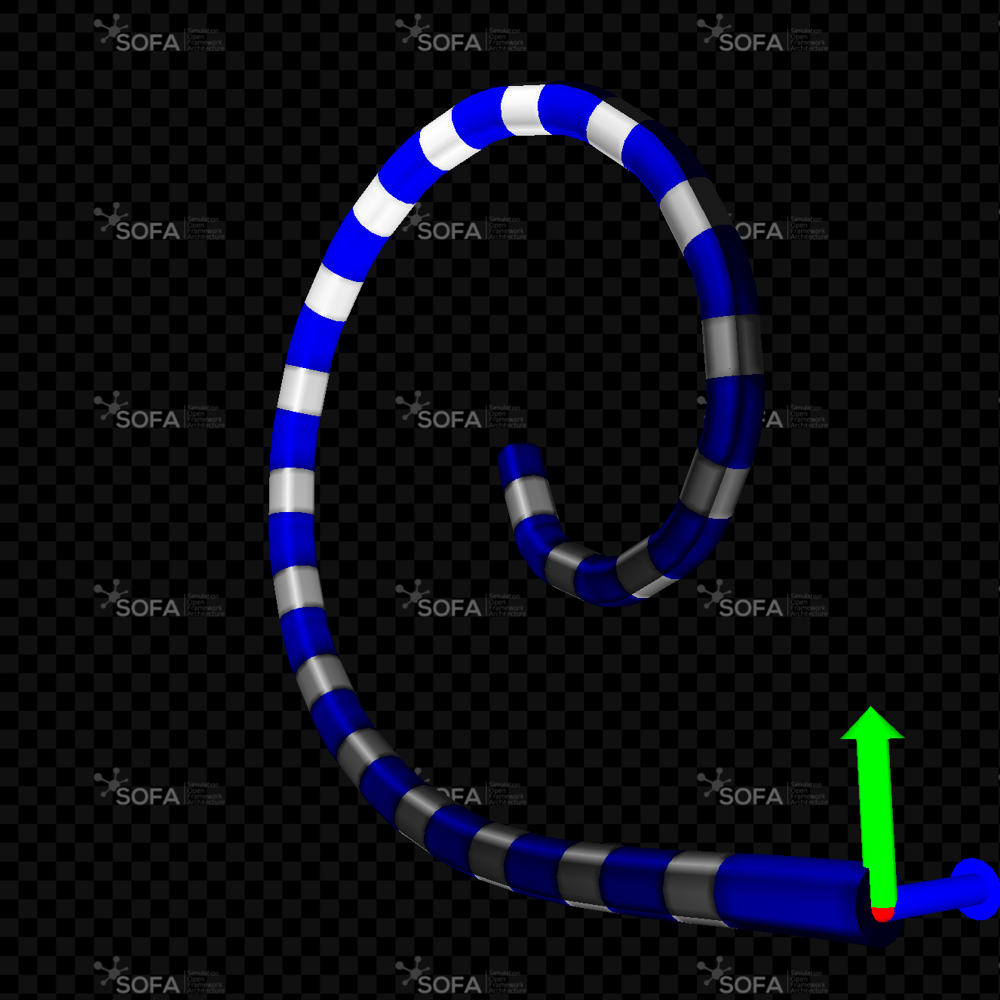
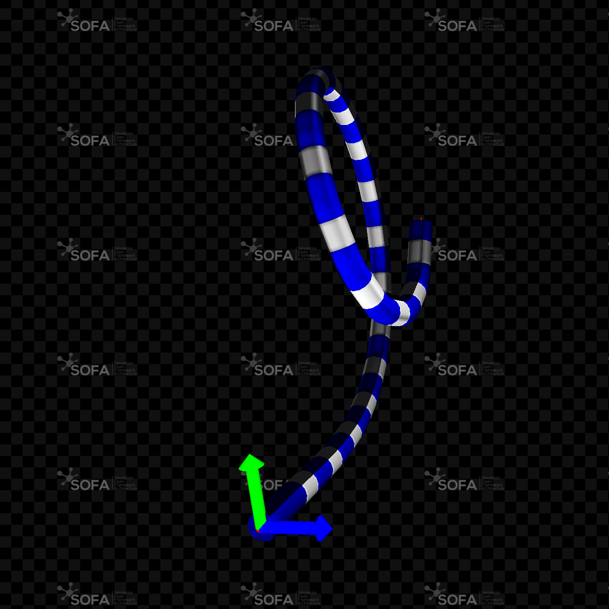
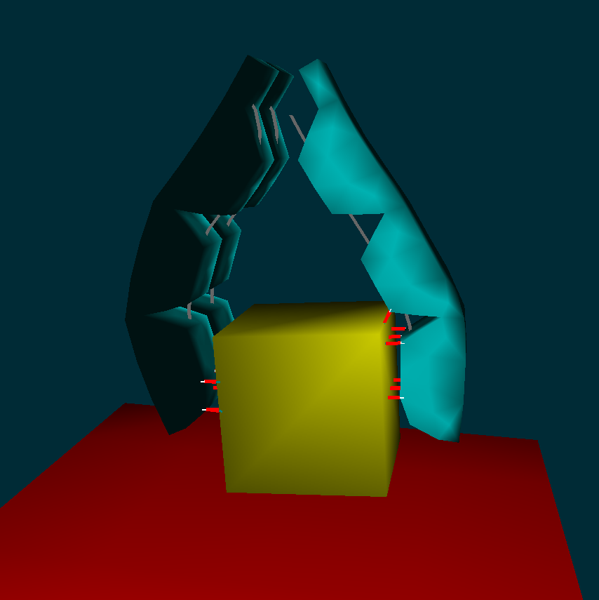
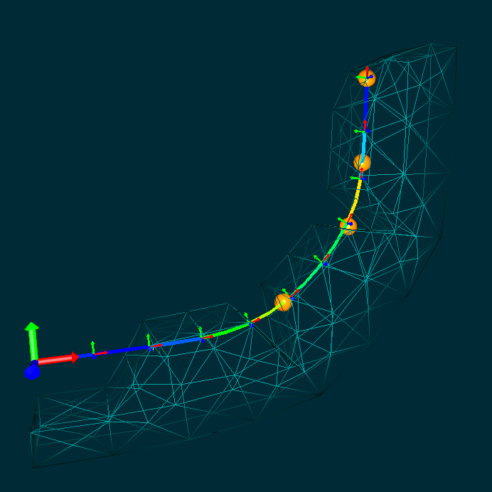
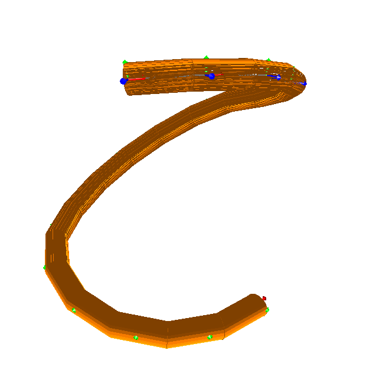
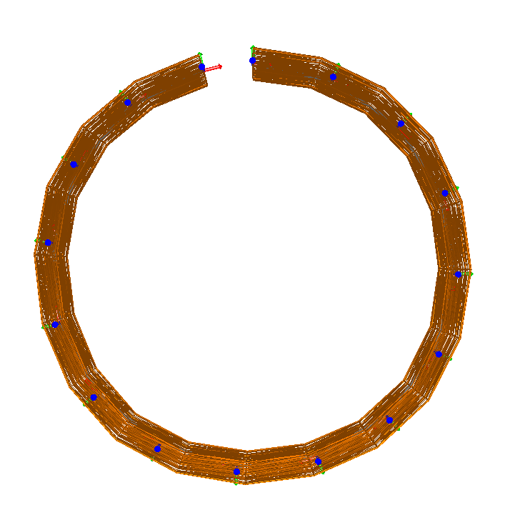
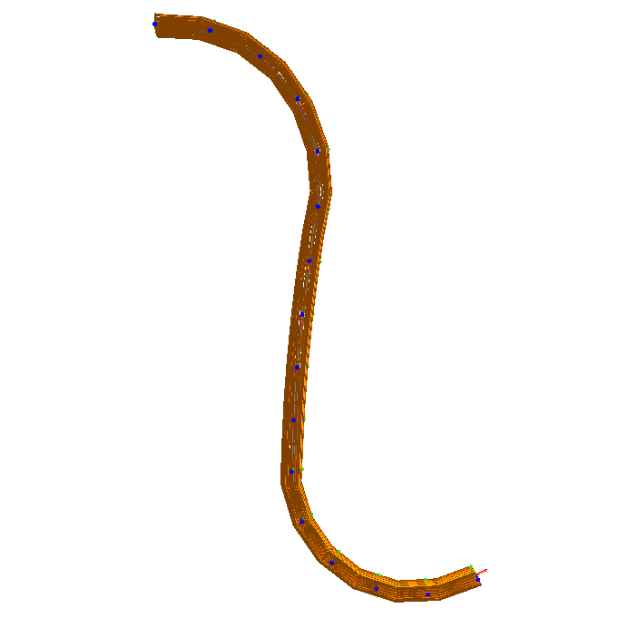
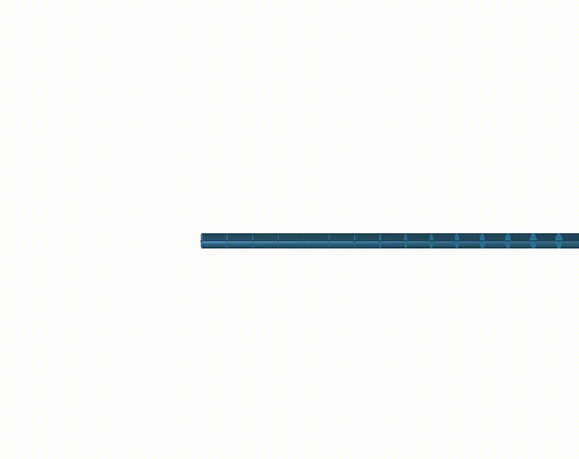

# Cosserat Plugin

## Overview

An open-source plugin compatible with the Sofa framework for simulating 1D objects. It enables modeling of rigid and flexible 1D entities such as rods, wires, or needles using Cosserat beam theory. You can create scenes in Python or XML, or develop new C++ components. Contributions are welcome!

## Theory and Background

The Cosserat model simulates deformation of robot bodies with rod-like geometry and mechanical properties. It replicates nonlinear deformations including bending, torsion, extension, and shearing.

Key feature: Each material point is treated as a rigid body with 6 degrees of freedom (3 translations + 3 rotations), unlike traditional models that treat points as particles with 3 translations.

This creates a framework similar to articulated solids, where relative positions are defined by strain states. Ideal for modeling concentric tube robots, cable-actuated continuum robots, or pneumatic soft robots with constant cross-sections.

For theoretical details: [Theory](examples/python3/tutorial/Writerside/topics/Theory.md)

## Features

### Piece-wise Constant Strain (PCS)
Based on:
- **Discrete cosserat approach for soft robot dynamics: A new piece-wise constant strain model with torsion and shears** [Link](https://ieeexplore.ieee.org/document/7759808)
- **Coupling numerical deformable models in global and reduced coordinates for the simulation of the direct and inverse kinematics of Soft Robots** [Link](https://hal.archives-ouvertes.fr/hal-03192168/document)

  

### Piece-wise Non-constant Strain
Allows strain to vary continuously within each beam section, enabling more accurate modeling of complex deformations compared to the constant strain assumption. Useful for beams with varying material properties or under non-uniform loads.

### DCM with Plastic Model
Extends the Discrete Cosserat Model to include plastic behavior, simulating permanent deformations in materials that exceed elastic limits. This is essential for modeling materials that undergo irreversible changes under stress.

## Use Cases and Applications

### Cochlear Implant Modeling
Using Discrete Cosserat Model (DCM):

| View 1 | View 2 | View 3 |
|--------|--------|--------|
|  |  |  |

### Cable Modeling for Deformable Robot Control

| Soft Gripper Simulation | Model Convergence Study |
|-------------------------|-------------------------|
|  |  |

### Actuation Examples

| Cable Actuation 1 | Cable Actuation 2 | Cable Actuation 3 |
|-------------------|-------------------|-------------------|
|  |  |  |

### Animation Examples

| Example 1 | Example 2 | Example 3 |
|-----------|-----------|-----------|
|  |  |  |

### Tripod with Bending Sensors

## Getting Started

Follow the tutorial: [Cosserat Tutorial](tutorial/text/cosserat_tutorial.md)

## Publications

1. **Discrete cosserat approach for soft robot dynamics: A new piece-wise constant strain model with torsion and shears**  
   [IEEE Link](https://ieeexplore.ieee.org/document/7759808)

2. **Coupling numerical deformable models in global and reduced coordinates for the simulation of the direct and the inverse kinematics of Soft Robots**  
   [IEEE Link](https://ieeexplore.ieee.org/abstract/document/9362217)  
   [PDF Download](https://hal.archives-ouvertes.fr/hal-03192168/document)

## Contributing

We welcome contributions! Please see our contribution guidelines and feel free to open issues or pull requests.
