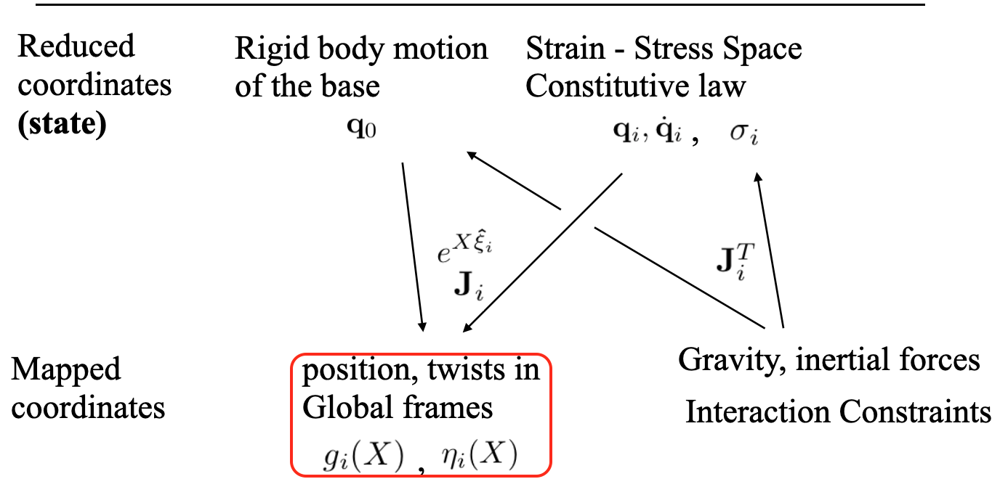

---
cssclasses:
  - dashboard
  - multi-column
  - two-column-list
tags:
  - tuto/cosserat
---
##### **Introduction to SOFA**
- Have SOFA installed on your machine 
- Install Cosserat plugin 
	- In Tree 
	- Out Tree
---
##### **Step 1: Installing SOFA**

Before you begin with the specific Cosserat plugin, you need to install SOFA. Follow these steps:

1. Go to the official SOFA website (https://www.sofa-framework.org/) to download the latest version.
2. Choose the appropriate version for your operating system (Windows, Linux, or macOS).
3. Follow the installation instructions for your OS. Typically, this involves extracting the downloaded archive and setting environment variables.
---
##### **Step 2: Setting Up the Cosserat Plugin**
Now, we'll dive into the essential part – configuring the Cosserat plugin within SOFA.
1. **Create plugins folder:** 
	- Create folder externalPlugins
	- **sofa**
		  - ├── **src**
		  - ├── **build**
		  - ├── **externalPlugins**

---
2. **Obtaining the Plugin:** 
- GitHub : https://github.com/SofaDefrost/Cosserat
- Download the plugin :
	- git clone git@github.com:SofaDefrost/Cosserat.git (if you are using ssh-key)
	- git clone https://github.com/SofaDefrost/Cosserat.git
	- or Download the **Zip**  
---

**3. Add *CMakeList.txt* file inside the *externalPlugin* folder**
```Cmake 
		cmake_minimum_required(VERSION 3.1)
		sofa_find_package(SofaFramework)
		
		sofa_add_subdirectory(plugin SofaPython3 SofaPython3 ON) # If you want to use python 
		sofa_add_subdirectory(plugin STLIB STLIB ON) # If you want to use python & Cosserat prefabs
		sofa_add_subdirectory(plugin Cosserat Cosserat ON)
```

---

**4. Activating the Plugin:** To activate the Cosserat plugin, follow these steps:

- Open your terminal and go to SOFA's **build-directory** 
	- run 
	```bash  
      cmake-gui .
    ```
    - In the *Search* bar, type **external**, 
    - In $SOFA\_EXTERNAL\_DIRECTORIES$ 
	    - Fill in the empty box with: 
	      - **path-to-cosserat-directory**
    - Find the Cosserat plugin and enable it
---

5. **First Cosserat Scene: *tuto_1.py***
   - As said previously, this component is based on the PCS (Piece-wise Constant Strain) formulation.
   
---
##### **Goals** :
- how to create a basic scene with the cosserat plugin
	- It is important to note the difference between : 
		- **section** and **frames**
		-  **section** and **cross-section**
- The notion of force-field : here **BeamHookeLawForceField**
- The notion of mapping: here **DiscreteCosseratMapping**
- Functions: **apply, applyJ**, **applyJT** for forces and **ApplyJ^T** for constraints
--- 
###### Start with the base 


---
###### The beam is always constructed along the x-axis
```python
   def _add_rigid_base(p_node):  
    rigid_base_node = p_node.addChild('rigid_base')  
    rigid_base_node.addObject('MechanicalObject', template='Rigid3d', name="cosserat_base_mo", position="0 0 0  0 0 0. 1", showObject=1, showObjectScale='0.1')  
    rigid_base_node.addObject('RestShapeSpringsForceField', name='spring', stiffness=stiffness_param, angularStiffness=stiffness_param, external_points="0", mstate="@cosserat_base_mo", points="0", template="Rigid3d")  
    return rigid_base_node
```

---
- Add Cosserat **Reduced coordinates** states (torsion and bending along y and z-axis) 
- Add **BeamHookeLawForceField** based on the Hooke's Law
```python 
def _add_cosserat_state(p_node, bending_states, list_sections_length, _radius=2.):  
    cosserat_coordinate_node = p_node.addChild('cosseratCoordinate')  
    cosserat_coordinate_node.addObject('MechanicalObject', template='Vec3d', name='cosserat_state', position=bending_states)  
    cosserat_coordinate_node.addObject('BeamHookeLawForceField', crossSectionShape='circular', length=list_sections_length, radius=2., youngModulus=1.e4, poissonRatio=0.4)  
    return cosserat_coordinate_node
```

---
###### Parameters :
```python
list_sections_length = [10, 10, 10] 
cos_nul_state = [0.0, 0.0, 0.0]  # torsion, y_bending, z_bending  
bending_states = [cos_nul_state, cos_nul_state, cos_nul_state]  
```
---
###### **BeamHookeLawForceField**
- **Force Computation**: The `addForce` method calculates and adds the forces acting on the beams. It uses Hooke's law to compute the forces based on the deformation of the beams and their properties. The computed forces are then stored in the `f` variable.
---
- **Derivative of Force Computation**: The `addDForce` method computes the derivative of the forces with respect to the deformation. This is used for stiffness matrix calculations in the context of finite element simulations.

---
- **Stiffness Matrix Computation**: The `addKToMatrix` method is responsible for adding the stiffness matrix to the global matrix. This is used in FEM to represent the stiffness of the entire system.
---
###### Add Mapped coordinates (frames) to the scene 
- **Mapping** between **Reduced coordinates** (Cosserat's state) and Global cordinates (Sofa state). 
	- Frames are multi-mapped (under Cosserat state and rigid base)

---
```python
def _add_cosserat_frame(p_node, _bending_node, framesF, _section_curv_abs, _frame_curv_abs, _radius, _beam_mass=0.0):  
    cosserat_in_Sofa_frame_node = p_node.addChild('cosserat_in_Sofa_frame_node')  
	_bending_node.addChild(cosserat_in_Sofa_frame_node)  
	frames_mo = cosserat_in_Sofa_frame_node.addObject('MechanicalObject', template='Rigid3d',  name="FramesMO", position=framesF, showIndices=0., showObject=0, showObjectScale=0.8)  
  
	cosserat_in_Sofa_frame_node.addObject('UniformMass', totalMass=_beam_mass)  
	cosserat_in_Sofa_frame_node.addObject('DiscreteCosseratMapping', curv_abs_input=_section_curv_abs, curv_abs_output=_frame_curv_abs, name='cosseratMapping', input1=_bending_node.cosserat_state.getLinkPath(), input2=p_node.cosserat_base_mo.getLinkPath(), output=frames_mo.getLinkPath(), debug=0, radius=_radius)  
    return cosserat_in_Sofa_frame_node
```
---
###### The notion of mapping: **DiscreteCosseratMapping**
- **apply** : It calculates how the positions of elements in the input models (deformations  and base) are transformed to the output model (rigid frames). The function applies the mapping to these input positions and updates the output frames accordingly.
- **applyJ** : compute the Jacobian matrix for the mapping operation. How small changes in input velocity (in this case, deformations) affect small changes in output velocity (in this case, the rigid frames).
---

- **applyJT force** : It updates forces in reduced coordinate based on forces in global coordinate.
- **applyJT Constraint** : It updates constraints in reduced coordinate based on constraints in global coordinate.

###### The complete scene 
----
- [x] Example 2: ****
     - script for automating sections and frames
     - **Goal**: show the role of the number of sections on the overall deformation
         - Example: 
             - 6 sections; 32 frames: $b_y=0.2$  on the last bending_state
             - 12 sections 32 frames:  $b_y=0.2$ on the last bending_state
             - 6 sections 6 frames: all variables $b_y=0.2$
                 - Change to frames = 12/24/32
                     - Shows that we have a smoother curvature than previously while emphasizing the fact that there is rather a geometry impact, but not a physical one.
----

- Scene ****
    - Use the $CosseratBase$ Python class and $prefabs$
```python
def createScene(root_node):
    addHeader(root_node)
    root_node.gravity = [0, -9.81, 0.]
    solver_node = addSolverNode(root_node, name="solver_node")

    # create cosserat Beam
    solver_node.addChild(CosseratBase(parent=solver_node, params=Params))
    return root_node
```
---
- Uses also python $dataclass$ 
```python 
- geoParams = BeamGeometryParameters(init_pos=[0., 0., 0.], beamLength=30., showFramesObject=1,nbSection=6, nbFrames=12, buildCollisionModel=0)
- physicsParams = BeamPhysicsParameters(beamMass=1., youngModulus=1.0e4, poissonRatio=0.38, beamRadius=1., beamLength=30)
- simuParams = SimulationParameters()
- Params = Parameters(beamGeoParams=geoParams, beamPhysicsParams=physicsParams, simuParams=simuParams)

```
---
##### Some known examples  
	- Force type 1
	- Force type 2
	- Force type 3

---
##### FEM & DCM coupling for finger actuation 
- The cable is modeled using the DCM
- The finger is modeled using FEM
- Constraints are based on the Lagrange multiplier
	- **QPSlidingConstraint**
	- **DifferenceMultiMapping**

---
##### An example of the use of pre-curved cables, use cases (see scenes from Flavie) [tuto9.py](http://tuto9.py)

---
##### Scene of three fingers lifting a cube ****[tuto8.py](http://tuto8.py)***

----

**Adding Constraints:** Depending on your simulation, you might need to introduce constraints that describe the interaction between the robot and its environment. This is also an essential part of configuring the scene.

---

---
