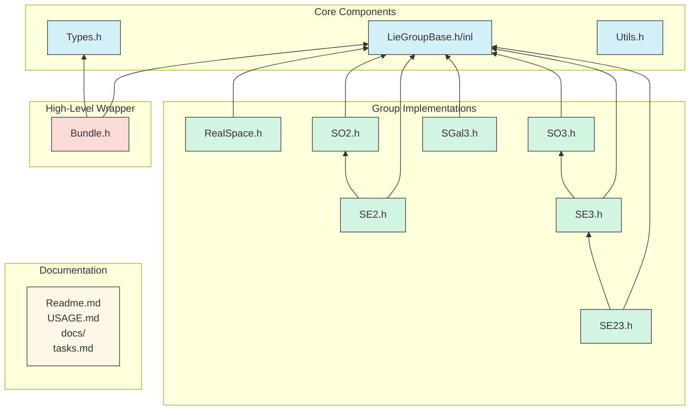

# Dependency Tree of Liegroups Folder

## Explanation of the Dependency Tree

The diagram above illustrates the dependencies between different files in the Liegroups folder:

1. **Core Components**:
   - `LieGroupBase.h/inl`: Base class for all Lie group implementations
   - `Types.h`: Contains common type definitions
   - `Utils.h`: Provides utility functions

2. **Group Implementations** (all depend on LieGroupBase):
   - `RealSpace.h`: Simplest implementation 
   - `SO2.h`: 2D rotation group
   - `SO3.h`: 3D rotation group
   - `SE2.h`: 2D rigid transformation (depends on SO2)
   - `SE3.h`: 3D rigid transformation (depends on SO3)
   - `SE23.h`: 3D rigid transformation with scale (depends on SE3)
   - `SGal3.h`: 3D similarity transformation

3. **High-Level Wrapper**:
   - `Bundle.h`: Combines multiple Lie groups using std::tuple and type_traits

4. **Documentation**:
   - Various documentation files explaining usage and implementation details

The arrows represent "depends on" relationships, showing which files include other files.

