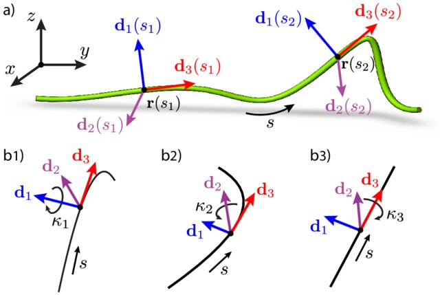

# Welcome to the SOFA-Cosserat Plugin Tutorial

## Introduction and Setup

### What You'll Learn

This tutorial will teach you how to model and control slender-soft robots using Cosserat rod theory in the SOFA simulation framework. By the end, you'll be able to:

- Create and simulate Cosserat rod models
- Understand the theory behind the model
- Apply forces and constraints to your models
- Integrate Cosserat models with other SOFA components

---

### Prerequisites

- Basic Python programming skills
- Familiarity with beam theory (reference: Gang's presentation)
- SOFA framework with the Cosserat plugin installed

---

### Cosserat Rod Theory - Overview

Cosserat rods are perfect for modeling slender deformable bodies like soft robot arms because they:

- Use a **centerline** to represent the rod's backbone trajectory
- Define a **material frame** to track orientation at each point
- Measure **strain** to calculate bending, twisting, and stretching
- Generate **internal forces** based on deformation

This approach naturally handles large deformations while remaining computationally efficient.

---

### SOFA Framework

- **S**imulation **O**pen **F**ramework **A**rchitecture
- Designed for physics-based simulation research
- Supports multiple physics models:
  - Finite Element Methods (FEM)
  - Rigid body dynamics
  - Contact modeling
  - Specialized models like Cosserat
- Uses **mappings** to connect different representations

---

### Tutorial Roadmap

1. **Introduction**: Cosserat theory and SOFA basics
2. **Basic Beam**: Creating your first Cosserat beam
3. **Dynamic Simulation**: Adding gravity and forces
4. **Parameter Exploration**: Effects of discretization
5. **Force Interactions**: Different ways to apply forces

We encourage you to ask questions and actively participate throughout this tutorial.

---

### Soft Robotics Context

Soft robotics is revolutionizing robotics by using:

- **Flexible** materials
- **Deformable** structures
- **Compliant** mechanisms

**Key advantages**:

- Adaptability to environments
- Safe human interaction
- Versatility across applications

---

### Soft Robotics Applications

- **Healthcare**: Minimally invasive surgery, rehabilitation
- **Industrial**: Safe manipulation, delicate handling
- **Search & Rescue**: Navigating confined spaces
- **Space Exploration**: Adapting to unknown environments

---

### Challenges in Soft Robotics

Modeling soft robots is challenging due to:

- **Non-linear deformations**
- **Complex control** requirements
- **Multi-dimensional** behaviors (1D, 2D, 3D)
- **Multi-physics** interactions

The Cosserat model helps address many of these challenges for 1D structures.

---

### 1D Modeling Approaches

Several methods exist for modeling 1D soft robots:

- **Geometric Methods**: Simple but limited accuracy
- **Mechanics Methods** (including Cosserat): Physically accurate
- **Statistical Methods**: Data-driven approaches
- **Computational Methods**: Numerical simulation
- **Analytical Methods**: Closed-form solutions

---

### Cosserat Theory Fundamentals

Cosserat theory models a rod by tracking:

1. Its centerline position r(s)
2. Material frame orientation (d₁, d₂, d₃)
3. Local deformation modes:
   - Material curvatures κ₁ and κ₂
   - Twist κ₃
   - Elongation and shear


_[Lazarus et al. 2013]_

---

### Discrete Cosserat Modeling (DCM)

DCM represents the continuous rod as:

- A series of rigid segments (6 DoF each)
- Connected with specific strain relationships
- Using reduced coordinates for efficiency


---

### Piece-wise Constant Strain (PCS)

The DCM implementation in SOFA uses a Piece-wise Constant Strain (PCS) approach:

- Divides the rod into sections with constant strain
- Efficiently models rigid, soft, or hybrid robots
- Accounts for shear, torsion, and bending
- Reduces computational complexity


---

### DCM Mathematical Formulation

**Configuration**: $g= \begin{pmatrix} \mathcal{R} & u \\ 0 & 1 \end{pmatrix} \in SE(3)$

**Strain**: $\xi(s,t) = g^{-1} \frac{\partial g}{\partial s} = \begin{bmatrix}\mathcal{k} \\ \mathcal{p} \end{bmatrix} \in \mathbb{R}^6$

**Velocity**: $\eta(s,t) =g^{-1}\frac{\partial g}{\partial t} = \begin{bmatrix}\mathcal{w} \\ \mathcal{v} \end{bmatrix} \in \mathbb{R}^6$

**Kinematics**: $\frac{\partial g}{\partial s} = g\hat{\xi}$ ; $\dot{g} = g\hat{\eta}$

**Differential Kinematics**: $\eta' = \dot{\xi} - ad_{\xi}\eta$

---

### DCM vs. Finite Element Method (FEM)

**DCM Advantages**:

- Efficient for slender structures
- Natural handling of large rotations
- Reduced coordinates (fewer variables)

**FEM Advantages**:

- Versatility with different geometries
- Customizable material laws
- Easy boundary condition definition
- Flexible for complex structures

---

### Combining DCM with FEM

For complex soft robots, we often combine approaches:

- DCM for cables, tendons, and slender parts
- FEM for volumetric bodies
- Connected through constraints

This hybrid approach provides:

- More accurate modeling
- Unified simulation framework
- Better performance for complex systems

---

## Getting Started with SOFA and Cosserat

### Installing SOFA

1. Download SOFA from [www.sofa-framework.org](https://www.sofa-framework.org)
2. Choose the appropriate version for your OS
3. Follow the installation instructions

### Installing the Cosserat Plugin

1. Create an `externalPlugins` folder in your SOFA directory
2. Clone the Cosserat plugin:
   ```bash
   git clone https://github.com/SofaDefrost/Cosserat.git
   ```
3. Add a CMakeLists.txt to the externalPlugins folder
4. Configure and build SOFA with the plugin

Let's now move to our first hands-on example!
