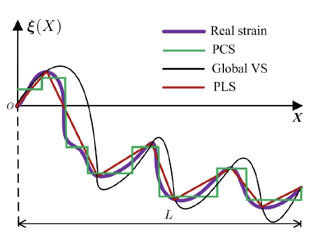
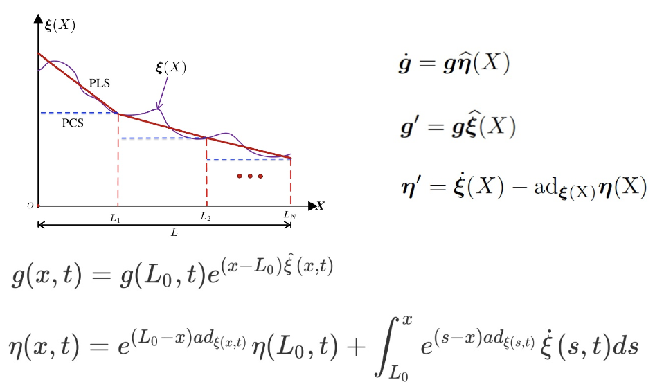
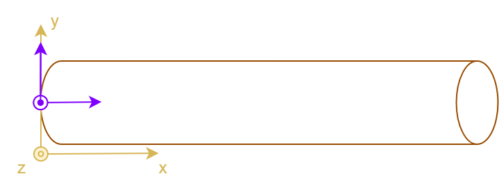
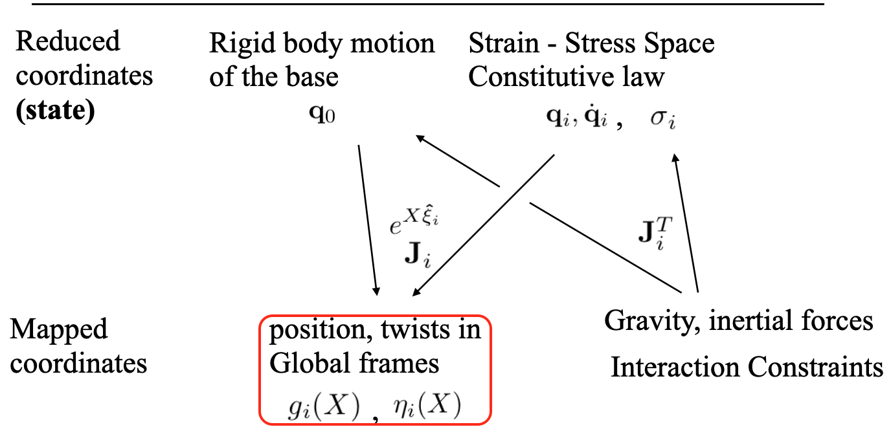

_Welcome to this tutorial on SOFA-Cosserat Plugin._

[Formation plugin : Cosserat - CodiMD](https://notes.inria.fr/gcfuFPDYSeeAlG4gzfDJwA#)

## Introduction and Setup

---

### What You'll Learn

This tutorial will teach you to model and control slender-soft robots using Cosserat rod theory in the SOFA simulation framework.

---

### Prerequisites

- Basic Python programming
- Have an idea of beam theory : go back to Gang's presentation
- SOFA framework with the lovely **Cosserat plugin** installed

---

### Cosserat Rod Theory - Quick Primer

Cosserat rods model slender deformable bodies (like soft robot arms) using:

- **Centerline**: The rod's backbone trajectory
- **Material frame**: Orientation at each point along the rod
- **Strain measures**: How the rod bends, twists, and stretches
- **Internal forces**: Resistance to deformation

This theory is perfect for soft robots because it naturally handles large deformations while remaining computationally efficient.

---

### SOFA

- SOFA : Simulation Open Framework Architecture
  - Dedicated to research
- Use for prototyping and development of physics-based simulation
  - FEM / Rigid (articulated) Bodies / Contacts / Other models...
  - Projections = MAPPING !

---

### Tutorial Roadmap

- What to expect ?
  - An overview of the theory of Discrete Cosserat Model
  - Numerics & Hands-on examples
    - Reduce coordinates
    - Reduce coordinate (Cosserat) to Global coordinate (SOFA) State
    - Boundary conditions and interaction forces
- Ask your questions and actively participate throughout this tutorial.
  - The first time I am doing this, so I need your feedback

---

### Introduction to Soft Robotics (SR)

- Soft robotics is an emerging and innovative field of robotics
- Focuses on the design and development of robots made from :
  - _Flexible_,
  - _Deformable_,
  - _Compliant materials_.

---

### Introduction to Soft Robotics (SR)

- Numerous advantages
  - _Adaptability_ : Their ability to deform and adapt to their environment
  - _Safety_ : Ideal for interactions with humans, delicate objects, or unstructured surroundings
  - _Versatility_ : Various applications

---

### **Key Applications**

- _Healthcare_ : The gentle and non-invasive nature of SR is necessary
- _Industrial automation_ : The high [Compliance](../../../Soft_Robot/Compliance.md), reduces the risk of damage during interactions with products
- _Search and rescue_ : they can navigate through tight spaces and uneven terrains
- _Space exploration_, and _extreme environments_

---

### **Challenges in Soft Robotics**

- _Modeling_ : due to non-linear deformable materials
- [_Control_](../../../Soft_Robot/kinematics_dynamics_control.md) : due to the non-linear, multi-body dynamics of deformable materials
- [_Multi-dimension_](../../../../../../Professionnel/research_md/Projects/ANR/brainStormingANR2023.md) : due to a wide range of shape, volume (3D), surface (2D) and cable (1D)
- [_Multi-physics_](../../../../../../Professionnel/research_md/Projects/ANR/RobotMulti-physics.md) : due a wide range of physical behaviors, including mechanical deformation, thermal effects, electrical responses,

---

### **Challenges in Soft Robotics**

- Addressing these challenges is crucial for the widespread adoption of soft robots in various fields.
  (To go further on the introduction of deformable robotics ⇾ [Introduction_General](../../../Soft_Robot/Introduction_General.md) )

---

#### How to model one 1D object ? see [oneDimensionModels](oneDimensionModels.md)

- **Geometric Methods**
- **Mechanics methods**
- _Statistical Methods_
- _Computational Methods_
- _Analytical Methods:_

---

### Cosserat Theory (Mechanics)

Choose strain as generalized coordinates, defined in global (or local) frame!


[Lazarus et al. 2013]

---

### Cosserat Theory (Mechanics)

- The configuration of the Cosserat rod is defined by its centerline r(s).
- The orientation of each mass point of the rod is represented by an orthonormal basis ($d_1(s), d_2(s), d_3(s)$)
- The three local modes of deformation of the elastic rod :
  - (b1) material curvature $κ_1$ related to the direction $d_1$ of the cross-section,
  - (b2) material curvature $κ_2$ related to $d_2$,
  - $κ_3$ twist.
- One and add three other modes :
  - elongation related to $d_1$
  - shearing related $d_2$
  - shearing related $d_3$

---

### Discrete Cosserat Modeling: DCM

- Serial rigid (6DoFs) bodies with reduced coordinates
  

---

### Discrete Cosserat Modeling: DCM

- Piece-wise Constant Strain (PCS, treats rigid, soft, or hybrid robots uniformly)
  

---

### Discrete Cosserat Modeling(DCM): Piece-Wise Constant Strain (PCS)

- Models the deformation of a soft manipulator arm using a finite number of sections
- PCS (Piece-Wise Constant Strain) is a modeling approach used in Discrete Cosserat Modeling (DCM)

- Accounts for shears and torsion

- -Simulates the inextensible behavior of a rod or cable

- PCS is particularly useful for simulating the behavior of soft robots, as it captures the essential characteristics of their deformation while reducing computational complexity.
  - Reduces model size, resulting in faster calculation times through the use of reduced coordinates.

---

### DCM (Kinematics)

- **Kinematics**: Describes the motion of the Cosserat rod without considering forces or torques.

- **Configuration**: The configuration of the Cosserat rod is represented by a transformation matrix $g \in SE(3)$, which includes both the position and orientation of the rod in 3D space.

- **Strain**: The strain $\xi(s,t)$ is defined as the change in configuration with respect to the arc length $s$ and time $t$. It captures how the rod deforms along its length.

- **Velocity**: The velocity $\eta(s,t)$ describes how the configuration changes over time, capturing the rod's motion.

---

### DCM

- Configuration $g= \begin{pmatrix}  \mathcal{R} & u \\  0 & 1  \end{pmatrix} ∈SE(3)$

- Strain $\begin{align}\xi(s,t) = g^{-1} \frac{\partial g}{\partial s} &= \begin{bmatrix}\mathcal{k} \\ \mathcal{p} \end{bmatrix}\end{align} \in R^6$

- Velocity $\begin{align}\eta(s,t) =g^{-1}\frac{\partial g}{\partial t} &= \begin{bmatrix}\mathcal{w} \\ \mathcal{v} \end{bmatrix}\end{align} \in R^6$

---

### DCM (Kinematics)

- => Kinematics (deformation) : $\frac{\partial g}{\partial s} = g'=g\hat{\xi}$ ; $\dot{g} = g\hat{\eta}$
- Differential Kinematics : $\eta'= \frac{\partial g}{\partial s}  = \dot{\xi} - ad_{\xi}\eta$

## 

---

### DCM (Dynamics)


---

### DCM Dynamic



---

### Approximation via PCS, VS and PLS



- **PCS**: A local approximation scheme employing a local constant strain assumption.
- **VS**: A global approximation method based on the chosen basis functions.
- **PLS**: A local approximation scheme with a linear strain function assumption.

---

### PCS Cosserat


---

### Discrete Cosserat Modeling: DCM

#### Limitations:

- Challenges in simulating truss structures, intricate geometries, or volumetric deformations

- The PCS parametrization of a manipulator is not rooted in the arm's intrinsic variables

---

### Finite Element Modeling (FEM)

The Finite Element (FE) approach is typically represented by the position and velocity (global coordinates) of a system of interconnected nodes.

- This approach offers several advantages:
  - **Versatility in object geometries:** It can be applied to a wide range of object geometries, including beams, shells, truss structures, and deformable volumes.
  - **Material law customization:** Material properties can be tailored to meet specific requirements.
  - **Ease of defining boundary conditions:** Boundary conditions for numerical models can be defined with ease.
  - **Flexibility for creating truss structures:** Beams can be interconnected freely to create truss structures.

---

### Finite Element Modeling (FEM)

However, this approach also has limitations:

- **Time-consuming:** Simulations using the FE approach may be computationally intensive and time-consuming.
- **Additional constraints:** Additional constraints are often needed to prevent the extension of rod-like structures when modeling certain systems.

---

### Modeling Soft Robots: Combining DCM with FEM

We combine Discrete Cosserat Modeling (DCM) with Finite Element Modeling (FEM) to harness the strengths of each model. This hybrid approach is particularly useful in scenarios like:

- Modeling the stiffness of cables used to actuate a soft robot with a deformable volumetric structure.

- This leads to a more realistic representation of the entire robot's behavior.

For example, it allows us to effectively simulate scenarios where inextensible cables are employed to control the motion of a soft robot.

---

##### Benefits of Combining DCM and FEM

_Combined Accuracy_: By combining FEM and DCM, you can leverage the strengths of both methods. FEM provides fine-grained material modeling, while DCM captures the shape and motion of deformable elements accurately. This leads to a more realistic representation of the entire robot's behavior.

- _Unified Simulation Framework_:A combined FEM-DCM framework creates a unified simulation environment that can model both the deformable body of the robot (using FEM) and the actuation components (using DCM). This simplifies simulation setup and control algorithms.

---

[Hands on](Setting%20up%20the%20Environment.md)

---

[[Complement]]

---


---

## **Introduction to SOFA**

- Have SOFA installed on your machine
- Install Cosserat plugin
  - In Tree
  - Out Tree

---

## **Step 1: Installing SOFA**

Before you begin with the specific Cosserat plugin, you need to install SOFA.

- **Follow these steps:**

1. Go to the official SOFA website (<https://www.sofa-framework.org/>) to download the latest version.
2. Choose the appropriate version for your operating system (Windows, Linux, or macOS).
3. Follow the installation instructions for your OS. Typically, this involves extracting the downloaded archive and setting environment variables.

---

## **Step 2: Setting Up the Cosserat Plugin**

Now, we'll dive into the essential part – configuring the Cosserat plugin within SOFA.

1. **Create plugins folder:**

   - Create folder externalPlugins
   - **sofa**
     - ├── **src**
     - ├── **build**
     - ├── **externalPlugins**

---

2. **Obtaining the Plugin:**

- GitHub : <https://github.com/SofaDefrost/Cosserat>
- Download the plugin :
  - git clone <git@github.com>:SofaDefrost/Cosserat.git (if you are using ssh-key)
  - git clone <https://github.com/SofaDefrost/Cosserat.git>
  - or Download the **Zip**

---

**3. Add _CMakeList.txt_ file inside the _externalPlugin_ folder**

```Cmake
 cmake_minimum_required(VERSION 3.1)
 sofa_find_package(SofaFramework)

 sofa_add_subdirectory(plugin SofaPython3 SofaPython3 ON) # If you want to use python
 sofa_add_subdirectory(plugin STLIB STLIB ON) # If you want to use python & Cosserat prefabs
 sofa_add_subdirectory(plugin Cosserat Cosserat ON)
```

---

**4. Activating the Plugin:** To activate the Cosserat plugin, follow these steps:

- Open your terminal and go to SOFA's **build-directory**

  - run

  ```bash
      cmake-gui .
  ```

  - In the _Search_ bar, type **external**,
  - In $SOFA\_EXTERNAL\_DIRECTORIES$
    - Fill in the empty box with:
      - **path-to-cosserat-directory**
  - Find the Cosserat plugin and enable it

---

5. **First Cosserat Scene: `tutorial_00_basic_beam.py`**
   - As said previously, this component is based on the PCS (Piece-wise Constant Strain) formulation.
     

---

## **Goals**

- how to create a basic scene with the cosserat plugin
  - It is important to note the difference between :
    - **section** and **frames**
    - **section** and **cross-section**
- The notion of force-field : here **BeamHookeLawForceField**
- The notion of mapping: here **DiscreteCosseratMapping**
- Functions: **apply, applyJ**, **applyJT** for forces and **ApplyJ^T** for constraints

---

#### Start with the base



---

(basic_00.py)[./tutorial_00_basic_beam.py]

---

## Let read the basic scene

### The beam is always constructed along the x-axis

```python

def _add_rigid_base(p_node, positions=None):
    """Create a rigid base node for the beam."""
    if positions is None:
        positions = [0, 0, 0, 0, 0, 0, 1]
    rigid_base_node = p_node.addChild("rigid_base")
    rigid_base_node.addObject(
        "MechanicalObject",
        template="Rigid3d",
        name="cosserat_base_mo",
        position=positions,
        showObject=True,
        showObjectScale="0.1",
    )
    rigid_base_node.addObject(
        "RestShapeSpringsForceField",
        name="spring",
        stiffness=stiffness_param,
        angularStiffness=stiffness_param,
        external_points="0",
        mstate="@cosserat_base_mo",
        points="0",
        template="Rigid3d",
    )
    return rigid_base_node
```

---

### The beam is constructed with a section

- Add Cosserat **Reduced coordinates** states (torsion and bending along y and z-axis)
- Add _BeamHookeLawForceField_ ==> (_HookseratForceField_) based on the Hooke's Law

```python
def _add_cosserat_state(p_node, geometry: CosseratGeometry, node_name="cosserat_coordinates", custom_bending_states=None):
    """Create the cosserat coordinate node using CosseratGeometry."""
    cosserat_coordinate_node = p_node.addChild(node_name)

    # Use geometry data or custom bending states
    bending_states = (
        custom_bending_states if custom_bending_states else geometry.bendingState
    )

    cosserat_coordinate_node.addObject(
        "MechanicalObject",
        template="Vec3d",
        name="cosserat_state",
        position=bending_states,
    )
    cosserat_coordinate_node.addObject(
        "BeamHookeLawForceField",
        crossSectionShape="circular",
        length=geometry.section_lengths,  # Use geometry data
        radius=2.0,
        youngModulus=1.0e3,
        poissonRatio=0.4,
    )
    return cosserat_coordinate_node
```

---

#### **BeamHookeLawForceField**

- **Force Computation**: The `addForce` method calculates and adds the forces acting on the beams.
  - It uses Hooke's law to compute the forces based on the deformation of the beams and their properties.
  - The computed forces are then stored in the `f` variable.

---

The `addForce` method computes and applies elastic forces to each section of a beam modeled using Hooke's Law. Here's how it works:

- It first checks for the presence of a valid mechanical state. If it doesn't, it stops the calculation.
- It retrieves the current position (`x`) and rest position (`x0`) of each section.

- For each section, it calculates the elastic force:
  - If the beam has homogeneous properties, it uses the global stiffness matrix (`m_K_section`).
  - If the beam has sections with different properties, it uses the stiffness matrix specific to each section (`m_K_sectionList[i]`).
- The applied force is proportional to the position difference, the stiffness, and the section length.

---

### Derivative of Force Computation:

<!--- **Derivative of Force Computation**: The `addDForce` method computes the derivative of the forces with respect to the deformation.
This is used for stiffness matrix calculations in the context of finite element simulations.
- It accesses the differential force vector (`d_df`) and the differential displacement vector (`d_dx`).
- It calculates a scaling factor (`kFactor`) that includes Rayleigh damping.
-->

The `addDForce` function computes and adds the differential (tangent) elastic forces for each beam section, which are used in implicit integration and stiffness matrix assembly.

- For each section, it computes the differential force as the product of the stiffness matrix,
  the differential displacement, the scaling factor, and the section length.
- If the beam has uniform properties, it uses a single stiffness matrix; otherwise, it uses a per-section matrix.

---

### **Stiffness Matrix Computation**:

- The addKToMatrix function adds the stiffness matrix contributions of the beam elements to a global matrix used in the simulation.

---

#### Add Mapped coordinates (frames) to the scene

- **Mapping** between **Reduced coordinates** (Cosserat's state) and Global cordinates (Sofa state). - Frames are multi-mapped (under Cosserat state and rigid base)
  

---

```python
def _add_cosserat_frame(
    p_node, bending_node, geometry: CosseratGeometry, node_name="cosserat_in_Sofa_frame_node", beam_mass=0.0
):
    """Create the cosserat frame node using CosseratGeometry."""
    cosserat_in_sofa_frame_node = p_node.addChild(node_name)
    bending_node.addChild(cosserat_in_sofa_frame_node)

    frames_mo = cosserat_in_sofa_frame_node.addObject(
        "MechanicalObject",
        template="Rigid3d",
        name="FramesMO",
        position=geometry.frames,  # Use geometry data
        showIndices=1,
        showObject=1,
        showObjectScale=0.8,
    )

    cosserat_in_sofa_frame_node.addObject("UniformMass", totalMass=beam_mass)

    cosserat_in_sofa_frame_node.addObject(
        "DiscreteCosseratMapping",
        curv_abs_input=geometry.curv_abs_sections,  # Use geometry data
        curv_abs_output=geometry.curv_abs_frames,  # Use geometry data
        name="cosseratMapping",
        input1=bending_node.cosserat_state.getLinkPath(),
        input2=p_node.cosserat_base_mo.getLinkPath(),
        output=frames_mo.getLinkPath(),
        debug=0,
        radius=beam_radius,
    )
    return cosserat_in_sofa_frame_node
```

---

### Mapping : From Cosserat state to Sofa state

##### The notion of mapping: **DiscreteCosseratMapping**

- **apply** : It calculates how the positions of elements in the input models (deformations and base) are transformed to the output model (rigid frames).
  The function applies the mapping to these input positions and updates the output frames accordingly.

- **applyJ** : compute the Jacobian matrix for the mapping operation.
  - How small changes in input velocity (in this case, deformations) affect small changes in output velocity (in this case, the rigid frames).

---

### Mapping : From Cosserat state to Sofa state

#### The notion of mapping: **DiscreteCosseratMapping**

- **applyJT force** : It updates forces in reduced coordinate based on forces in global coordinate.

- **applyJT Constraint** : It updates constraints in reduced coordinate based on constraints in global coordinate.

---

#### The complete scene 

- [x] Example 2: ****
  - script for automating sections and frames
  - **Goal**: show the role of the number of sections on the overall deformation
    - Example:
      - 6 sections; 32 frames: $b_y=0.2$ on the last bending_state
      - 12 sections 32 frames: $b_y=0.2$ on the last bending_state
      - 6 sections 6 frames: all variables $b_y=0.2$
        - Change to frames = 12/24/32
          - Shows that we have a smoother curvature than previously while emphasizing the fact that there is rather a geometry impact, but not a physical one.

---

- Scene ****
  - Use the $CosseratBase$ Python class and $prefabs$

```python
def createScene(root_node):
    addHeader(root_node)
    root_node.gravity = [0, -9.81, 0.]
    solver_node = addSolverNode(root_node, name="solver_node")

    # create cosserat Beam
    solver_node.addChild(CosseratBase(parent=solver_node, params=Params))
    return root_node
```

---

##### Parameters

- The parameters are defined in a separate file, which allows for easy modification and reuse.

- Uses also python $dataclass$

```python
- geoParams = BeamGeometryParameters(init_pos=[0., 0., 0.], beamLength=30., showFramesObject=1,nbSection=6, nbFrames=12, buildCollisionModel=0)
- physicsParams = BeamPhysicsParameters(beamMass=1., youngModulus=1.0e4, poissonRatio=0.38, beamRadius=1., beamLength=30)
- simuParams = SimulationParameters()
- Params = Parameters(beamGeoParams=geoParams, beamPhysicsParams=physicsParams, simuParams=simuParams)

```

---

##### Some known examples 

    - Force type 1
    - Force type 2
    - Force type 3

---

##### FEM & DCM coupling for finger actuation 

- The cable is modeled using the DCM
- The finger is modeled using FEM
- Constraints are based on the Lagrange multiplier
  - **QPSlidingConstraint**
  - **DifferenceMultiMapping**

---

##### An example of the use of pre-curved cables, use cases (see scenes from Flavie) [tuto9.py](http://tuto9.py)

---

##### Scene of three fingers lifting a cube \***_[tuto8.py](http://tuto8.py)_**

---

**Adding Constraints:** Depending on your simulation, you might need to introduce constraints that describe the interaction between the robot and its environment.
This is also an essential part of configuring the scene.

---

---

---

##### [FEM and DCM](../../docs/DCM_FEM.md)

- _FEM's Material Modeling_: FEM excels at modeling the deformations and stress distributions in complex materials, including soft and deformable ones. It considers the local behavior of materials, making it more accurate for understanding the mechanical properties of soft robots.
- _Cosserat theory's Beam-Like Modeling_: DCM, on the other hand, is suitable for modeling the overall shape and bending of structures, making it a natural choice for cables, rods, and flexible elements in soft robots.
