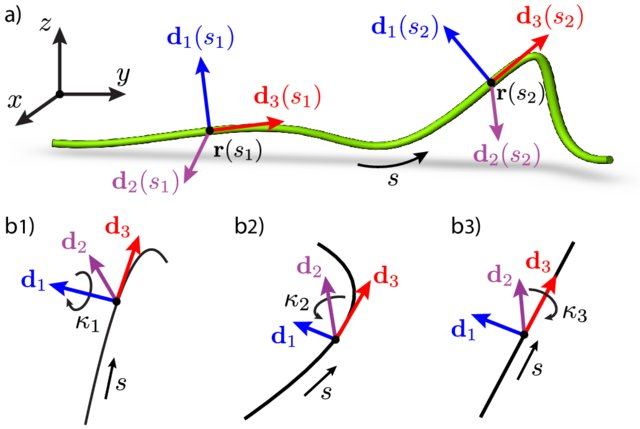

# Welcome to the SOFA-Cosserat Plugin Tutorial

## Introduction and Setup

### What You'll Learn

This tutorial will teach you how to model and control slender-soft robots using Cosserat rod theory in the SOFA simulation framework. By the end, you'll be able to:

- Create and simulate Cosserat rod models
- Understand the theory behind the model
- Apply forces and constraints to your models
- Integrate Cosserat models with other SOFA components

---

### Prerequisites

- Basic Python programming skills
- Familiarity with beam theory (reference: Gang's presentation)
- SOFA framework with the Cosserat plugin installed

---

### Cosserat Rod Theory - Overview

Cosserat rods are perfect for modeling slender deformable bodies like soft robot arms because they:

- Use a **centerline** to represent the rod's backbone trajectory
- Define a **material frame** to track orientation at each point
- Measure **strain** to calculate bending, twisting, and stretching
- Generate **internal forces** based on deformation

This approach naturally handles large deformations while remaining computationally efficient.

---

### SOFA Framework

- **S**imulation **O**pen **F**ramework **A**rchitecture
- Designed for physics-based simulation research
- Supports multiple physics models:
  - Finite Element Methods (FEM)
  - Rigid body dynamics
  - Contact modeling
  - Specialized models like Cosserat
- Uses **mappings** to connect different representations

---

### Tutorial Roadmap

1. **Introduction**: Cosserat theory and SOFA basics
2. **Basic Beam**: Creating your first Cosserat beam
3. **Dynamic Simulation**: Adding gravity and forces
4. **Parameter Exploration**: Effects of discretization
5. **Force Interactions**: Different ways to apply forces

We encourage you to ask questions and actively participate throughout this tutorial.

---

### Soft Robotics Context

Soft robotics is revolutionizing robotics by using:

- **Flexible** materials
- **Deformable** structures
- **Compliant** mechanisms

**Key advantages**:

- Adaptability to environments
- Safe human interaction
- Versatility across applications

---

### Soft Robotics Applications

- **Healthcare**: Minimally invasive surgery, rehabilitation
- **Industrial**: Safe manipulation, delicate handling
- **Search & Rescue**: Navigating confined spaces
- **Space Exploration**: Adapting to unknown environments

---

### Challenges in Soft Robotics

Modeling soft robots is challenging due to:

- **Non-linear deformations**
- **Complex control** requirements
- **Multi-dimensional** behaviors (1D, 2D, 3D)
- **Multi-physics** interactions

The Cosserat model helps address many of these challenges for 1D structures.

---

### 1D Modeling Approaches

Several methods exist for modeling 1D soft robots:

- **Geometric Methods**: Simple but limited accuracy
- **Mechanics Methods** (including Cosserat): Physically accurate
- **Statistical Methods**: Data-driven approaches
- **Computational Methods**: Numerical simulation
- **Analytical Methods**: Closed-form solutions

---

### Cosserat Theory Fundamentals

Cosserat theory models a rod by tracking:

1. Its centerline position r(s)
2. Material frame orientation (d₁, d₂, d₃)
3. Local deformation modes:
   - Material curvatures κ₁ and κ₂
   - Twist κ₃
   - Elongation and shear


_[Lazarus et al. 2013]_

---

### Discrete Cosserat Modeling (DCM)

DCM represents the continuous rod as:

- A series of rigid segments (6 DoF each)
- Connected with specific strain relationships
- Using reduced coordinates for efficiency


---

### Piece-wise Constant Strain (PCS)

The DCM implementation in SOFA uses a Piece-wise Constant Strain (PCS) approach:

- Divides the rod into sections with constant strain
- Efficiently models rigid, soft, or hybrid robots
- Accounts for shear, torsion, and bending
- Reduces computational complexity


---

### DCM Mathematical Formulation

**Configuration**: $g= \begin{pmatrix} \mathcal{R} & u \\ 0 & 1 \end{pmatrix} \in SE(3)$

**Strain**: $\xi(s,t) = g^{-1} \frac{\partial g}{\partial s} = \begin{bmatrix}\mathcal{k} \\ \mathcal{p} \end{bmatrix} \in \mathbb{R}^6$

**Velocity**: $\eta(s,t) =g^{-1}\frac{\partial g}{\partial t} = \begin{bmatrix}\mathcal{w} \\ \mathcal{v} \end{bmatrix} \in \mathbb{R}^6$

**Kinematics**: $\frac{\partial g}{\partial s} = g\hat{\xi}$ ; $\dot{g} = g\hat{\eta}$

**Differential Kinematics**: $\eta' = \dot{\xi} - ad_{\xi}\eta$

---

### DCM vs. Finite Element Method (FEM)

**DCM Advantages**:

- Efficient for slender structures
- Natural handling of large rotations
- Reduced coordinates (fewer variables)

**FEM Advantages**:

- Versatility with different geometries
- Customizable material laws
- Easy boundary condition definition
- Flexible for complex structures

---

### Combining DCM with FEM

For complex soft robots, we often combine approaches:

- DCM for cables, tendons, and slender parts
- FEM for volumetric bodies
- Connected through constraints

This hybrid approach provides:

- More accurate modeling
- Unified simulation framework
- Better performance for complex systems

---

## Getting Started with SOFA and Cosserat

### Installing SOFA

1. Download SOFA from [www.sofa-framework.org](https://www.sofa-framework.org)
2. Choose the appropriate version for your OS
3. Follow the installation instructions

---

### Installing the Cosserat Plugin

1. Create an `externalPlugins` folder in your SOFA directory
2. Clone the Cosserat plugin:
   ```bash
   git clone https://github.com/SofaDefrost/Cosserat.git
   ```
3. Add a CMakeLists.txt to the externalPlugins folder
4. Configure and build SOFA with the plugin

Let's now move to our first hands-on example!

---

---

## **Step 2: Setting Up the Cosserat Plugin**

Now, we'll dive into the essential part – configuring the Cosserat plugin within SOFA.

1. **Create plugins folder:**

   - Create folder externalPlugins
   - **sofa**
     - ├── **src**
     - ├── **build**
     - ├── **externalPlugins**

---

2. **Obtaining the Plugin:**

- GitHub : <https://github.com/SofaDefrost/Cosserat>
- Download the plugin :
  - git clone <git@github.com>:SofaDefrost/Cosserat.git (if you are using ssh-key)
  - git clone <https://github.com/SofaDefrost/Cosserat.git>
  - or Download the **Zip**

---

**3. Add _CMakeList.txt_ file inside the _externalPlugin_ folder**

```Cmake
 cmake_minimum_required(VERSION 3.1)
 sofa_find_package(SofaFramework)

 sofa_add_subdirectory(plugin SofaPython3 SofaPython3 ON) # If you want to use python
 sofa_add_subdirectory(plugin STLIB STLIB ON) # If you want to use python & Cosserat prefabs
 sofa_add_subdirectory(plugin Cosserat Cosserat ON)
```

---

**4. Activating the Plugin:** To activate the Cosserat plugin, follow these steps:

- Open your terminal and go to SOFA's **build-directory**

  - run

  ```bash
      cmake-gui .
  ```

  - In the _Search_ bar, type **external**,
  - In $SOFA\_EXTERNAL\_DIRECTORIES$
    - Fill in the empty box with:
      - **path-to-cosserat-directory**
  - Find the Cosserat plugin and enable it

---

5. **First Cosserat Scene: `tutorial_00_basic_beam.py`**
   - As said previously, this component is based on the PCS (Piece-wise Constant Strain) formulation.
     

---

## **Goals**

- how to create a basic scene with the cosserat plugin
  - It is important to note the difference between :
    - **section** and **frames**
    - **section** and **cross-section**
- The notion of force-field : here **BeamHookeLawForceField**
- The notion of mapping: here **DiscreteCosseratMapping**
- Functions: **apply, applyJ**, **applyJT** for forces and **ApplyJ^T** for constraints

---

#### Start with the base


---

(basic_00.py)[./tutorial_00_basic_beam.py]

---

## Let read the basic scene

### The beam is always constructed along the x-axis

```python

def _add_rigid_base(p_node, positions=None):
    """Create a rigid base node for the beam."""
    if positions is None:
        positions = [0, 0, 0, 0, 0, 0, 1]
    rigid_base_node = p_node.addChild("rigid_base")
    rigid_base_node.addObject(
        "MechanicalObject",
        template="Rigid3d",
        name="cosserat_base_mo",
        position=positions,
        showObject=True,
        showObjectScale="0.1",
    )
    rigid_base_node.addObject(
        "RestShapeSpringsForceField",
        name="spring",
        stiffness=stiffness_param,
        angularStiffness=stiffness_param,
        external_points="0",
        mstate="@cosserat_base_mo",
        points="0",
        template="Rigid3d",
    )
    return rigid_base_node
```

---

### The beam is constructed with a section

- Add Cosserat **Reduced coordinates** states (torsion and bending along y and z-axis)
- Add _BeamHookeLawForceField_ ==> (_HookseratForceField_) based on the Hooke's Law

```python
def _add_cosserat_state(p_node, geometry: CosseratGeometry, node_name="cosserat_coordinates", custom_bending_states=None):
    """Create the cosserat coordinate node using CosseratGeometry."""
    cosserat_coordinate_node = p_node.addChild(node_name)

    # Use geometry data or custom bending states
    bending_states = (
        custom_bending_states if custom_bending_states else geometry.bendingState
    )

    cosserat_coordinate_node.addObject(
        "MechanicalObject",
        template="Vec3d",
        name="cosserat_state",
        position=bending_states,
    )
    cosserat_coordinate_node.addObject(
        "BeamHookeLawForceField",
        crossSectionShape="circular",
        length=geometry.section_lengths,  # Use geometry data
        radius=2.0,
        youngModulus=1.0e3,
        poissonRatio=0.4,
    )
    return cosserat_coordinate_node
```

---

#### **BeamHookeLawForceField**

- **Force Computation**: The `addForce` method calculates and adds the forces acting on the beams.
  - It uses Hooke's law to compute the forces based on the deformation of the beams and their properties.
  - The computed forces are then stored in the `f` variable.

---

The `addForce` method computes and applies elastic forces to each section of a beam modeled using Hooke's Law. Here's how it works:

- It first checks for the presence of a valid mechanical state. If it doesn't, it stops the calculation.
- It retrieves the current position (`x`) and rest position (`x0`) of each section.

- For each section, it calculates the elastic force:
  - If the beam has homogeneous properties, it uses the global stiffness matrix (`m_K_section`).
  - If the beam has sections with different properties, it uses the stiffness matrix specific to each section (`m_K_sectionList[i]`).
- The applied force is proportional to the position difference, the stiffness, and the section length.

---

### Derivative of Force Computation:

<!--- **Derivative of Force Computation**: The `addDForce` method computes the derivative of the forces with respect to the deformation.
This is used for stiffness matrix calculations in the context of finite element simulations.
- It accesses the differential force vector (`d_df`) and the differential displacement vector (`d_dx`).
- It calculates a scaling factor (`kFactor`) that includes Rayleigh damping.
-->

The `addDForce` function computes and adds the differential (tangent) elastic forces for each beam section, which are used in implicit integration and stiffness matrix assembly.

- For each section, it computes the differential force as the product of the stiffness matrix,
  the differential displacement, the scaling factor, and the section length.
- If the beam has uniform properties, it uses a single stiffness matrix; otherwise, it uses a per-section matrix.

---

### **Stiffness Matrix Computation**:

- The addKToMatrix function adds the stiffness matrix contributions of the beam elements to a global matrix used in the simulation.

---

#### Add Mapped coordinates (frames) to the scene

- **Mapping** between **Reduced coordinates** (Cosserat's state) and Global cordinates (Sofa state). - Frames are multi-mapped (under Cosserat state and rigid base)
  

---

```python
def _add_cosserat_frame(
    p_node, bending_node, geometry: CosseratGeometry, node_name="cosserat_in_Sofa_frame_node", beam_mass=0.0
):
    """Create the cosserat frame node using CosseratGeometry."""
    cosserat_in_sofa_frame_node = p_node.addChild(node_name)
    bending_node.addChild(cosserat_in_sofa_frame_node)

    frames_mo = cosserat_in_sofa_frame_node.addObject(
        "MechanicalObject",
        template="Rigid3d",
        name="FramesMO",
        position=geometry.frames,  # Use geometry data
        showIndices=1,
        showObject=1,
        showObjectScale=0.8,
    )

    cosserat_in_sofa_frame_node.addObject("UniformMass", totalMass=beam_mass)

    cosserat_in_sofa_frame_node.addObject(
        "DiscreteCosseratMapping",
        curv_abs_input=geometry.curv_abs_sections,  # Use geometry data
        curv_abs_output=geometry.curv_abs_frames,  # Use geometry data
        name="cosseratMapping",
        input1=bending_node.cosserat_state.getLinkPath(),
        input2=p_node.cosserat_base_mo.getLinkPath(),
        output=frames_mo.getLinkPath(),
        debug=0,
        radius=beam_radius,
    )
    return cosserat_in_sofa_frame_node
```

---

### Mapping : From Cosserat state to Sofa state

##### The notion of mapping: **DiscreteCosseratMapping**

- **apply** : It calculates how the positions of elements in the input models (deformations and base) are transformed to the output model (rigid frames).
  The function applies the mapping to these input positions and updates the output frames accordingly.

- **applyJ** : compute the Jacobian matrix for the mapping operation.
  - How small changes in input velocity (in this case, deformations) affect small changes in output velocity (in this case, the rigid frames).

---

### Mapping : From Cosserat state to Sofa state

#### The notion of mapping: **DiscreteCosseratMapping**

- **applyJT force** : It updates forces in reduced coordinate based on forces in global coordinate.

- **applyJT Constraint** : It updates constraints in reduced coordinate based on constraints in global coordinate.

---

#### The complete scene 

- [x] Example 2: ****
  - script for automating sections and frames
  - **Goal**: show the role of the number of sections on the overall deformation
    - Example:
      - 6 sections; 32 frames: $b_y=0.2$ on the last bending_state
      - 12 sections 32 frames: $b_y=0.2$ on the last bending_state
      - 6 sections 6 frames: all variables $b_y=0.2$
        - Change to frames = 12/24/32
          - Shows that we have a smoother curvature than previously while emphasizing the fact that there is rather a geometry impact, but not a physical one.

---

- Scene ****
  - Use the $CosseratBase$ Python class and $prefabs$

```python
def createScene(root_node):
    addHeader(root_node)
    root_node.gravity = [0, -9.81, 0.]
    solver_node = addSolverNode(root_node, name="solver_node")

    # create cosserat Beam
    solver_node.addChild(CosseratBase(parent=solver_node, params=Params))
    return root_node
```

---

##### Parameters

- The parameters are defined in a separate file, which allows for easy modification and reuse.

- Uses also python $dataclass$

```python
- geoParams = BeamGeometryParameters(init_pos=[0., 0., 0.], beamLength=30., showFramesObject=1,nbSection=6, nbFrames=12, buildCollisionModel=0)
- physicsParams = BeamPhysicsParameters(beamMass=1., youngModulus=1.0e4, poissonRatio=0.38, beamRadius=1., beamLength=30)
- simuParams = SimulationParameters()
- Params = Parameters(beamGeoParams=geoParams, beamPhysicsParams=physicsParams, simuParams=simuParams)

```

---

##### Some known examples 

    - Force type 1
    - Force type 2
    - Force type 3

---

##### FEM & DCM coupling for finger actuation 

- The cable is modeled using the DCM
- The finger is modeled using FEM
- Constraints are based on the Lagrange multiplier
  - **QPSlidingConstraint**
  - **DifferenceMultiMapping**

---

##### An example of the use of pre-curved cables, use cases (see scenes from Flavie) [tuto9.py](http://tuto9.py)

---

##### Scene of three fingers lifting a cube \***_[tuto8.py](http://tuto8.py)_**

---

**Adding Constraints:** Depending on your simulation, you might need to introduce constraints that describe the interaction between the robot and its environment.
This is also an essential part of configuring the scene.

---

---

---

##### [FEM and DCM](../../docs/DCM_FEM.md)

- _FEM's Material Modeling_: FEM excels at modeling the deformations and stress distributions in complex materials, including soft and deformable ones. It considers the local behavior of materials, making it more accurate for understanding the mechanical properties of soft robots.
- _Cosserat theory's Beam-Like Modeling_: DCM, on the other hand, is suitable for modeling the overall shape and bending of structures, making it a natural choice for cables, rods, and flexible elements in soft robots.
